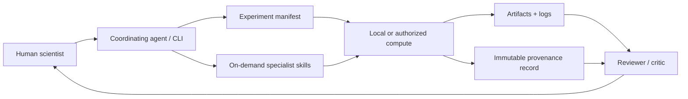

# Top-level Design

```text
Versioned Framework → Independent Research Projects → Optional Local/HPC/Cloud Platform
```



## Mental models

- **Experiment directory = scientific transaction:** intent, execution, evidence, and review live together.
- **Manifest = control plane:** it declares the command, outputs, stage, and acceptance criteria.
- **Artifacts + records = data plane:** artifacts communicate results; records prove how they arose.
- **Skills = lazy expertise:** instructions/scripts are loaded only when relevant, keeping context bounded.

The initial implementation is deliberately thin: filesystem contracts plus a Python CLI. Connectors,
HPC adapters, evidence databases, notebook rendering, and rich UI can be added behind these contracts.
